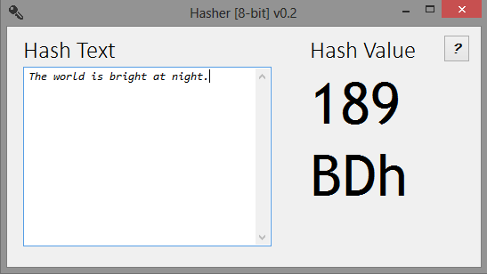

**TextHash** is a demo application that calculates that hash-value of
a string of text using super-fast `ROR+XOR` method. Calculation of hash
is done on the fly, as soon as you type, making it easier to evaluate the
strength of `ROR+XOR` hash technique.

`ROR+XOR` hash is as fast as `XOR` fast, but is immune from the
following issues that `XOR` hash suffers from:
- repeating characters cancel each other `hash(abb) = hash(a)`
- does not depend on order of characters `hash(hello) = hash(loleh)`
- for a simple text highest bit is never used `hash(<text>).bit(7) == 0`

`ROR+XOR` hash solves these issues simple by rotating the bits by one bit
after each operation.
 
 

 
Open **TextHash**. 
 
 

 
Start writing some text. Hash value is calculated as you type.
 
 

 
Notice how the hash value varies with each character.
 
 

 
Moving characters around changes the has value.
 
 
